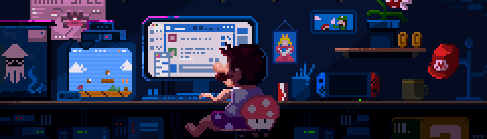

<!--Header Name-->
# HEY, I'M RHITAM 
*Tech Aficionado (Developer / Programmer)*
  

  

<!--Start Intro-->               

I am a Full Stack Developer and Machine Learning Enthusiast with a deep passion for React.js, Node.js, REST APIs, Java, and Python.

- ✨ Lifelong learner :)
- 🌱 Currently learning many things, I believe that everyday is a learning opportunity.
- 💁‍♂️ Feel free to reach out to me at rhitam.rit54@gmail.com
- 💻 Visit my [Portfolio](https://portfolio-rhitam.netlify.app/) for more details about my work and projects.
- ⚡ Fun Fact - I am lazy but smart

<!--End Intro-->

<!--Profile Count Badge-->

  

  

  

 

 
 

<!--Languages and Tools Section-->       
<h1 align="center">Tᴇᴄʜ sᴛᴀᴄᴋ & Aᴄʜɪᴇᴠᴇᴍᴇɴᴛs</h1> 
<picture>
  <source media="(prefers-color-scheme: dark)" srcset="./Skills_Animation_Dark.gif">
  
</picture>
 

<h3 align="left">Current Learning</h3>
<ul align="left">
  <li>Deepening my knowledge in Machine Learning and AI.</li>
  <li>Exploring advanced React.js patterns and state management techniques.</li>
  <li>Improving my skills in problem solving</li>
</ul>

<h3 align="left">Latest Achievements</h3>
<ul align="left">
  <li><a href="https://www.linkedin.com/posts/rhitam-chaudhury-66b17b248_amazonmlsummerschool-machinelearning-ai-activity-7213810449060888577-XO7g?utm_source=share&utm_medium=member_desktop">Member of Amazon ML Summer School '24</a></li>
  <li><a href="https://www.linkedin.com/posts/rhitam-chaudhury-66b17b248_sih2023-smartindiahackathon2023-aicte-activity-7146450274608472065-wtw2?utm_source=share&utm_medium=member_desktop">Smart India Hackathon 2023 Finalist</a></li>
  <li><a href="https://www.linkedin.com/posts/rhitam-chaudhury-66b17b248_gdsc-googledevelopers-coreabrmember-activity-7099090957748363264-QLXa?utm_source=share&utm_medium=member_desktop">Google DSC Core Member of our college</a></li>
</ul>

<!--
<h3 align="left">Latest Blog Posts</h3>
<ul align="left">
  <li><a href="https://dev.to/dev_kiran/21-vs-code-extensions-to-boost-your-productivity-1fil">21 VS Code Extensions To Boost Your Productivity</a></li>
  <li><a href="https://dev.to/dev_kiran/html-tags-you-might-not-know-about-3gk7">HTML Tags You Might Not Know About</a></li>
  <li><a href="https://dev.to/dev_kiran/meet-codiumate-your-coding-agent-47ie">Meet Codiumate - Your coding Agent🤖</a></li>
</ul>
-->

 
 
 
 
 
 

                    

## 🌐 Socials:
     

 
 

<!--Trophies Section-->   
<h1 align="center">🏆 Gɪᴛʜᴜʙ Tʀᴏᴘʜɪᴇs 🏆</h1>

  <a href="https://github.com/hallowshaw">
    <picture>
      <source media="(prefers-color-scheme: dark)" srcset="https://github-profile-trophy.vercel.app/?username=hallowshaw&no-bg=true&row=1&column=8&margin-w=20&margin-h=20&theme=monokai">
      <source media="(prefers-color-scheme: light)" srcset="https://github-profile-trophy.vercel.app/?username=hallowshaw&no-bg=true&row=2&column=6&margin-w=20&margin-h=20">
      
    </picture>
  </a>

 

<!--

  

  

-->

<!--Github stats Table--> 
<h1 align="center">📊 Gɪᴛʜᴜʙ Sᴛᴀᴛs 📊</h1>

<table width="100%">
  <tr>
    <td width="50%">
      <h3 align="center"><strong>Gɪᴛʜᴜʙ Sᴛᴀᴛs</strong></h3>
      

        
      

    </td>
    <td width="50%">
      <h3 align="center"><strong>Sᴛʀᴇᴀᴋ Sᴛᴀᴛs</strong></h3>
      

        
      

    </td>
  </tr>
  <tr>
    <td width="50%">
      <h3 align="center"><strong>Lᴀᴛᴇsᴛ Pʀᴏᴊᴇᴄᴛ</strong></h3>
      

        
      

    </td>
    <td width="50%">
      <h3 align="center"><strong>Tᴏᴘ Cᴏɴᴛʀɪʙᴜᴛɪᴏɴs</strong></h3>
      

        
      

    </td>
  </tr>
</table>
 

<!--Contribution Graph-->
<h2 align="center">📈 Cᴏɴᴛʀɪʙᴜᴛɪᴏɴ Gʀᴀᴘʜ 📈</h2>

    

 
 
 

<h1 align="center">⭐ LᴇᴇᴛCᴏᴅᴇ Sᴛᴀᴛs ⭐</h1>

  

 
 

<!-- 
### 🔝 Github Profile Summary Card

 
 
 
 -->

<h1 align="center">🌟 Tʜᴏᴜɢʜᴛ ᴏғ ᴛʜᴇ Dᴀʏ 🌟</h1>
<!--STARTS_HERE_QUOTE_CARD-->

    

<!--ENDS_HERE_QUOTE_CARD-->

 
 

 
<em><b>I love connecting with new people, so feel free to say hi! 😊</em>

<!--Footer--> 

  

